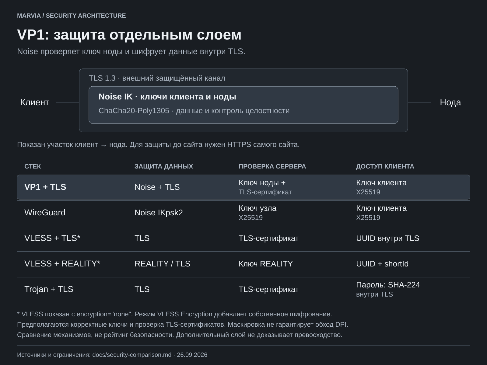

<div align="center">


**Свой VPN целиком: протокол, ноды, панель и приложения для Android и Windows.**

Тот, кто раздаёт доступ, ставит панель одним скриптом, а ноду — строкой из
панели. Тот, кто подключается, получает одну ссылку: приложение само выбирает
ноду, а если она перестала отвечать — ищет рабочую.

[Русский](README.md) · [English](README.en.md) · [简体中文](README.zh-CN.md) · [فارسی](README.fa.md)

[](https://github.com/jytt8u/marvia/releases/download/v0.13.0-alpha.7/marvia-android.apk)
[Обновлять через Obtainium](https://apps.obtainium.imranr.dev/redirect?r=obtainium://app/%7B%22id%22%3A%22io.marvia.android%22%2C%22url%22%3A%22https%3A%2F%2Fgithub.com%2Fjytt8u%2Fmarvia%22%2C%22author%22%3A%22jytt8u%22%2C%22name%22%3A%22Marvia%22%2C%22additionalSettings%22%3A%22%7B%5C%22includePrereleases%5C%22%3Atrue%2C%5C%22verifyLatestTag%5C%22%3Afalse%2C%5C%22apkFilterRegEx%5C%22%3A%5C%22%5Emarvia-android%5C%5C%5C%5C.apk%24%5C%22%7D%22%7D)
[](https://github.com/jytt8u/marvia/releases/tag/v0.13.0-alpha.7)
[](#установка-панели)
[](docs/guide.md)

**Стадия — alpha, `0.13.0-alpha.7`.** Выпуск 1.0 отложен до проверки на
реальных устройствах и сетях — [критерии](docs/development-plan.md).
Свежая тестовая сборка — [v0.13.0-alpha.7](https://github.com/jytt8u/marvia/releases/tag/v0.13.0-alpha.7); стабильной она не объявляется.

[Свой VPN с нуля](docs/start-from-zero.md) · [Releases](https://github.com/jytt8u/marvia/releases) · [CI](https://github.com/jytt8u/marvia/actions) · [Privacy](docs/privacy.md)

</div>

## Приложение

Android · реальные снимки эмулятора версии 0.12.2 · без добавленного ключа

| Главная | Настройки VPN | Сеть и приватность |
|:---:|:---:|:---:|
|  |  |  |

<details>
<summary>Windows и панель — сохранённые снимки</summary>

Windows 0.9.3 и локальный стенд панели. Это архивные снимки интерфейса.


</details>

## Архитектура


Панель управляет доступом; пакеты идут через ноду без панели.
[Границы доверия](docs/architecture.md).

## Защита VP1



**Отдельная Noise-сессия внутри TLS:** проверка ключа ноды и шифрование данных
не зависят только от внешнего TLS-канала. Это отличие архитектуры, а не
доказательство, что VP1 безопаснее всех остальных.
[Сравнение, источники и границы защиты](docs/security-comparison.md).

В списке доступа VP1 — **0 закрытых ключей клиентов**: ноде достаточно публичных.
[Автоматическая проверка 26.09.2026](docs/security-checks/2026-09-26/README.md):
0 достижимых известных уязвимостей после обновления зависимостей;
8,55 млн запусков четырёх fuzz-тестов без найденного сбоя. Это не независимый аудит.

[Проверка VP1 и QUIC 06.10.2026](docs/security-checks/2026-10-06.md): исправлены
продолжение повреждённой сессии и утечка UDP-сокетов. Паузы общего потока
воспроизведены на стенде; причина скачков на реальном LTE ещё не установлена.

**Что видит продавец и чего не видит.** Панель не хранит адресов покупателей,
нода держит их только ради лимита устройств — в памяти и час, журналы не
пишут ни адресов, ни сайтов. Что при этом технически видит любая выходная
нода и от чего VPN не защищает — [docs/privacy.md](docs/privacy.md).

## VP1 стал быстрее


**+56% к прежней версии VP1 в локальном тесте.** Меньше лишних записей TLS; шифрование и совместимость сохранены. Оптимизация сохранена в текущей разработке и не относится к старой сборке v0.12.2.

Пять парных прогонов по 512 МиБ на одном ПК, без интернета и TUN.
Это прирост локальной пропускной способности, не обещание ускорить интернет на 56%.

[До и после: данные](docs/benchmarks/2026-09-26-record-fit/README.md) ·
[Полное сравнение с VLESS и Trojan](docs/performance.md) · [Код теста](cmd/marvia-bench)
В полном локальном сравнении VLESS и Trojan пока быстрее VP1.

## Протоколы

WireGuard и OpenVPN передают IP-пакеты; остальные строки — прокси. На Android
Marvia создаёт системный VPN-интерфейс и для сторонних прокси-ключей.

| Протокол | Транспорт и отличие | Поддержка Marvia |
|---|---|---|
| **[VP1](docs/protocol.md)** | Noise-прокси поверх TLS/REALITY, WebSocket или QUIC; QUIC при недоступном UDP переходит на TCP | Своя нода, Android и Windows |
| [WireGuard](https://www.wireguard.com/protocol/) | IP-туннель через UDP; штатной маскировки под HTTPS нет | Android: сторонний ключ |
| [OpenVPN](https://openvpn.net/community-docs/community-articles/openvpn-2-7-manual.html) | IP-туннель через UDP или TCP с TLS; это отдельный протокол, а не обычный HTTPS | Не встроен |
| [VLESS + REALITY](https://xtls.github.io/en/config/transports/reality.html) | Прокси через TCP с маскировкой TLS под целевой сайт | Нода и Android |
| [Trojan](https://github.com/trojan-gfw/trojan/blob/master/docs/protocol.md) | Прокси внутри TLS с сайтом-прикрытием | Нода и Android |
| [Shadowsocks](https://shadowsocks.org/doc/what-is-shadowsocks.html) | Шифрованный TCP/UDP-прокси; сам по себе не выглядит как HTTPS | Android: сторонний ключ |
| [Hysteria 2](https://v2.hysteria.network/docs/developers/Protocol/) | Прокси через QUIC/UDP с видом HTTP/3; требуется доступный UDP | Android: сторонний ключ |

WireGuard, OpenVPN, Hysteria 2 и Xray в этом бенчмарке не запускались.
VP1 не совместим с клиентами WireGuard или Xray.

## Что внутри

| Клиент | Сервер |
|---|---|
| Android: свои и чужие ключи, QR из галереи и камеры без сервисов Google, выбор ноды, статистика, настройки VPN, запросы имён по HTTPS мимо глаз ноды, «Продлить» и «Поддержка» от продавца; обновление подписок и напоминания в фоне с учётом ограничений Android | Панель и ноды: лимиты, учёт, тарифы и продление в два нажатия, QR-код и текст для Telegram, резервные копии, API бота, переезд с Marzban и 3x-ui; страница покупателя по ссылке подписки — срок, трафик, QR, загрузки приложений и связь с продавцом; ссылки поддержки и «Продлить» и объявление в подписке для Happ, v2RayTun, Hiddify |
| Windows: TUN-клиент, российские сайты и домашняя сеть напрямую, выбор DNS и шифрование запросов имён, дробление приветствия, несколько ключей, расход за неделю, выключатель IPv6 и отчётов, «Поддержка» и «Продлить» от продавца | VP1, VLESS и Trojan; проверяемое обновление нод |

При ручном выборе страны приложение подключается к выбранной ноде без ожидания
замеров остальных; если она недоступна, ищет рабочую запасную.

## Чем отличается от других

| Проект | Основной фокус | Сильная сторона |
|---|---|---|
| **Marvia** | Панель + ноды + свои Android/Windows + VP1 | один комплект для покупателя и владельца |
| [Marzban](https://github.com/Gozargah/Marzban) | Xray-панель | периодические квоты, Telegram-бот; есть отдельный [Nabzram](https://github.com/Gozargah/Nabzram) |
| [Remnawave](https://docs.rw/) | Xray-панель и ноды | шаблоны Mihomo/sing-box, контроль устройств |
| [3x-ui](https://docs.sanaei.dev/docs/) | Xray-панель | широкий выбор протоколов и админ-инструментов |

Marvia пока уступает по автоматическому месячному сбросу квот. Переехать с Marzban и 3x-ui можно с прежними ключами и адресами
подписки — [как и что при этом меняется](docs/guide.md#переезд-с-marzban-и-3x-ui). Сравнение основано на документации проектов по
ссылкам в таблице; сравнимых замеров скорости конкурентов пока нет.

## Начать

> **Получили ключ?** Скачайте [Android APK](https://github.com/jytt8u/marvia/releases/download/v0.13.0-alpha.7/marvia-android.apk)
> или [установщик Windows](https://github.com/jytt8u/marvia/releases/tag/v0.13.0-alpha.7) (`marvia-windows-setup.exe`;
> [подробнее](docs/start-from-zero.md#6-выпустить-доступ-себе-и-подключить-клиент)),
> добавьте ссылку `marvia://…` в приложении и подключитесь.

Android также принимает VLESS, VMess, Trojan, Shadowsocks, Hysteria2 и WireGuard.
В Google Play приложения пока нет.

Для обновлений через Obtainium ссылка выше добавляет GitHub Releases,
включая тестовые alpha/beta, и выбирает `marvia-android.apk`.
Вручную: добавьте `https://github.com/jytt8u/marvia`, включите предварительные
выпуски и задайте фильтр APK `^marvia-android\.apk$`.
[Конфигурация](docs/obtainium.json).

Публичная alpha.7 — тестовая.
Полная проверка на реальных устройствах ещё не завершена.
Известные ограничения — в [списке изменений](CHANGELOG.md).

### Как проверить, что файл настоящий

**APK** подписан одним ключом с первого выпуска. Отпечаток сертификата
SHA-256:

```
53:EB:5B:D4:4A:38:1C:BA:E1:9B:76:06:EF:20:91:9E:33:DF:FB:26:0D:49:F2:D4:AD:86:88:85:36:4D:7E:82
```

На телефоне его показывает приложение [AppVerifier](https://github.com/soupslurpr/AppVerifier),
на компьютере — `apksigner verify --print-certs marvia-android.apk` из Android SDK.
Другой отпечаток — не наш файл, не ставьте. После установки Android сам не
даст обновить приложение файлом с чужой подписью.

**APK с 0.13.0-alpha.2, панель, нода и Windows** собираются на GitHub из тега.
APK более ранних выпусков собирал автор у себя: его подпись подтверждает, кто
выпустил файл, но не то, из какого кода он собран. Суммы всех файлов
подписаны через Sigstore — подпись доказывает, что файлы собрала сборка
этого репозитория, а не кто-то по дороге:

```bash
gh attestation verify SHA256SUMS --bundle SHA256SUMS.sigstore.json --repo jytt8u/marvia && sha256sum -c SHA256SUMS --ignore-missing
```

### Установка панели

Нужны Linux-сервер и домен с A-записью. Установщик берётся из
[тестового выпуска v0.12.2](https://github.com/jytt8u/marvia/releases/tag/v0.12.2).
Для одного VPS панель использует 8443, нода — 443. Полная подготовка и проверка
сумм описаны в [инструкции с нуля](docs/start-from-zero.md):

```bash
curl -fsSL https://github.com/jytt8u/marvia/releases/download/v0.12.2/install-panel.sh -o install-panel.sh
sudo sh install-panel.sh --domain panel.example.com --email you@example.com --port 8443 --from https://github.com/jytt8u/marvia/releases/download/v0.12.2/marvia_linux_amd64.tar.gz
```

Сохраните показанный при установке админский токен. Затем создайте ноду и
клиента в панели. [Полный порядок](docs/guide.md) · [API бота](docs/bot.md).

## Что пока не готово

- Google Play: проверка новой сборки на телефоне, декларации и тестирование. [План публикации](docs/google-play.md).
- Автоматический месячный сброс квоты. При переезде с Marzban и 3x-ui — VMess,
  Shadowsocks, ссылки с Vision и базы MySQL и PostgreSQL.
- iOS, приём подписок Clash/sing-box в наших приложениях, TUIC, плагины Shadowsocks и раздельный отзыв
  устройств с общим ключом.
- На Windows — приложения мимо туннеля, kill switch, статистика за месяц и
  ключ с картинки QR: это пока есть только на телефоне.
- Шифрование запросов имён (DoH) проверено тестами, но ещё не на живых
  телефоне и компьютере. Оно прячет от ноды имена, но не адреса сайтов и не
  имя в TLS-приветствии (SNI): их нода видит по-прежнему.
  [Что видит нода](docs/guide.md#запросы-имён-и-нода).

Для будущей 1.x планируется проверенная обратная совместимость API бота,
схемы `marvia://` и формата подписки. Сейчас действует стадия alpha.
Marvia не продаёт доступ, не принимает
платежи и не размещает серверы.

## Документы и сборка

[Руководство](docs/guide.md) ·
[Архитектура](docs/architecture.md) ·
[Протокол VP1](docs/protocol.md) ·
[Конфиденциальность](docs/privacy.md) ·
[История версий](CHANGELOG.md) ·
[Участие](CONTRIBUTING.md) ·
[Уязвимости](SECURITY.md)

Для серверных бинарников нужен Go 1.26.6+:

```bash
go test ./...
go vet ./...
go build -o bin/ ./...
```

APK собирает и подписывает сборка выпуска на GitHub, когда ключ лежит в
секретах окружения `release`; иначе — [`scripts/publish-apk.ps1`](scripts/publish-apk.ps1)
со своего ПК. В репозитории ключа нет.

## Лицензия

[AGPL-3.0](LICENSE). Пользоваться, изменять и раздавать можно свободно. Кто
раздаёт изменённую панель, ноду или приложение — в том числе даёт ими
пользоваться по сети, — открывает свои изменения под той же лицензией.
