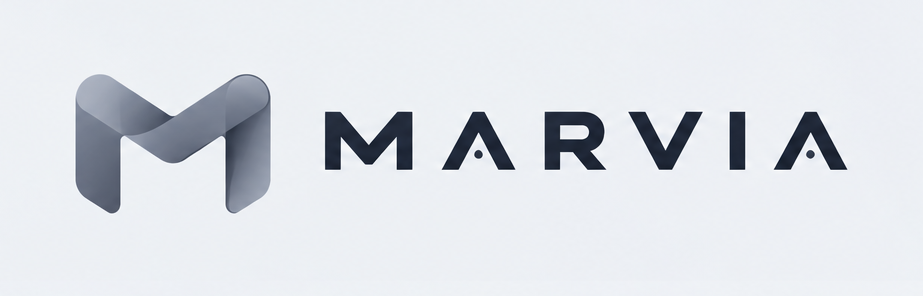
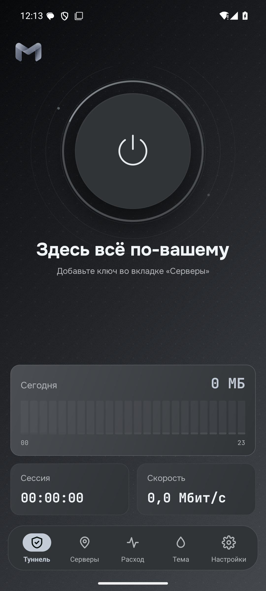
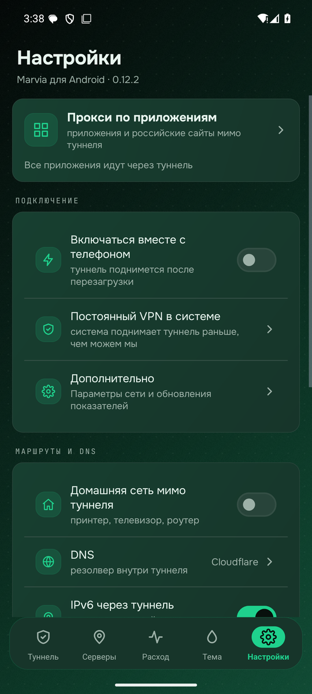
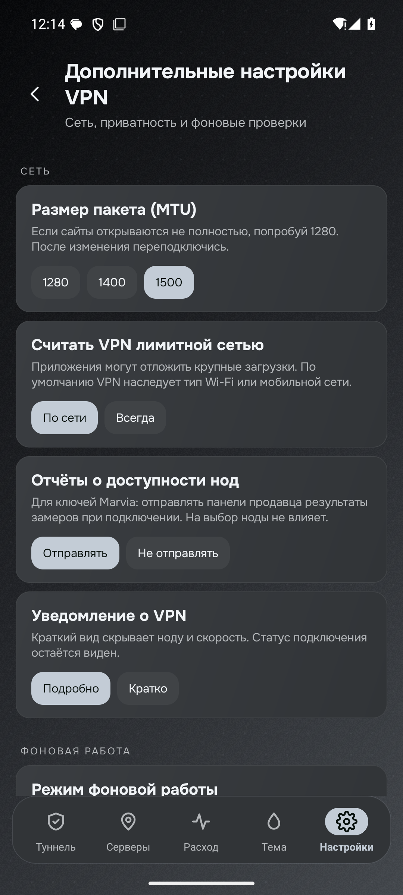
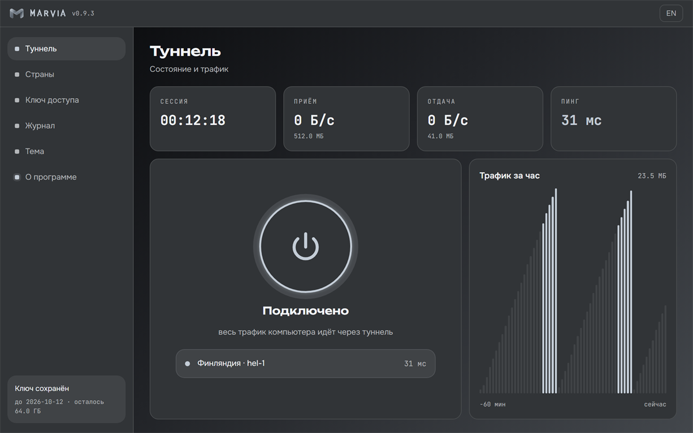
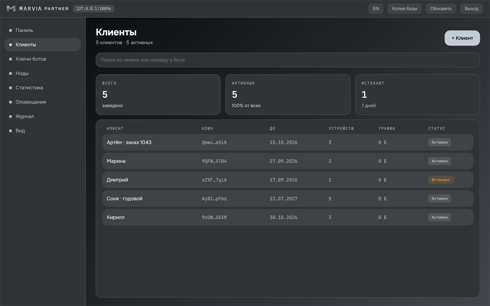
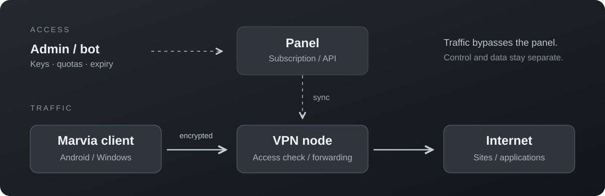
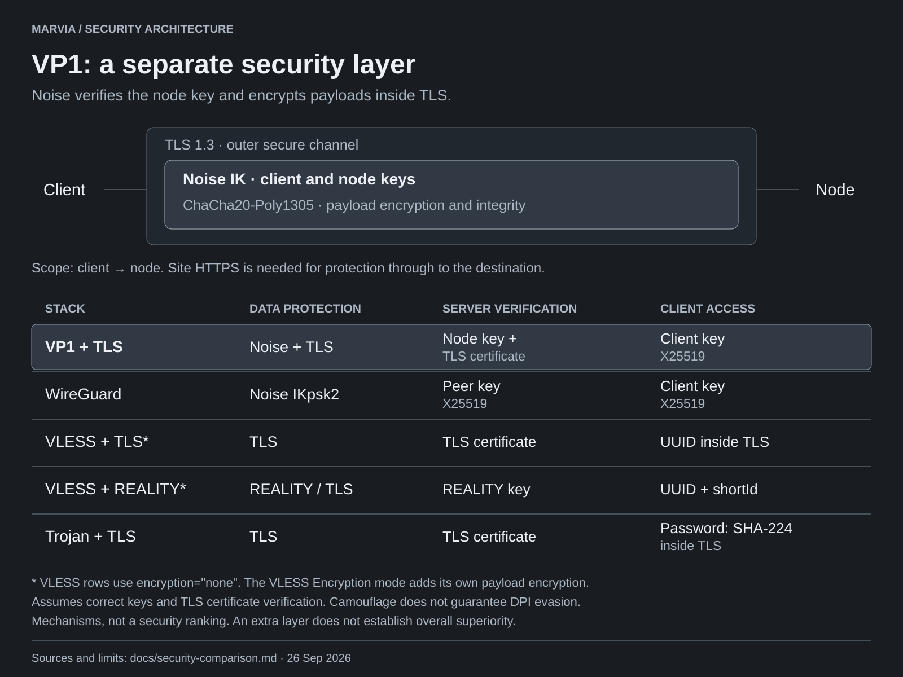
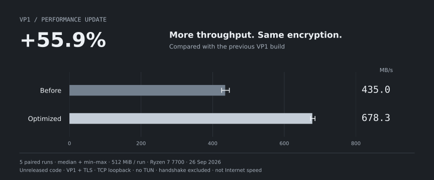

<div align="center">



**完整的自建 VPN：协议、节点、管理面板，以及 Android 和 Windows 应用。**

分发访问权限的人用一个脚本安装面板，再用面板给出的一行命令添加节点。
连接的人只需要一个链接：应用自动选择节点，节点停止响应时会寻找可用的节点。

[Русский](README.md) · [English](README.en.md) · [简体中文](README.zh-CN.md)

[](https://github.com/jytt8u/marvia/releases/download/v0.12.2/marvia-android.apk)
[](docs/start-from-zero.md#6-выпустить-доступ-себе-и-подключить-клиент)
[](#安装面板)
[](docs/guide.md)

**当前阶段：alpha，`0.13.0-alpha.1`。** 1.0 推迟发布，直到在真实设备和网络上完成验证——
[标准（俄语）](docs/development-plan.md)。已公开的 v0.12.2 是测试版本，不宣称稳定。

[从零搭建自己的 VPN（俄语）](docs/start-from-zero.md) · [Releases](https://github.com/jytt8u/marvia/releases) · [CI](https://github.com/jytt8u/marvia/actions) · [Privacy](docs/privacy.md)

</div>

## 应用界面

Android · 0.12.2 版本的模拟器真实截图 · 尚未添加密钥

| 主页 | VPN 设置 | 网络与隐私 |
|:---:|:---:|:---:|
|  |  |  |

<details>
<summary>Windows 与面板：历史截图</summary>

Windows 0.9.3 与本地面板实例。这些是旧版界面截图。




</details>

## 架构



面板管理访问权限；VPN 数据包由节点转发，不经过面板。
[信任边界](docs/architecture.md)。

## VP1 的安全机制



**TLS 内独立的 Noise 会话：**节点密钥验证和数据加密不完全依赖外层 TLS。
这是架构上的区别，并不证明 VP1 比所有其他协议更安全。
[对比、来源与保护范围（俄语）](docs/security-comparison.md)。

VP1 访问记录中保存的客户端私钥数量为 **0**，节点只需公钥。
[2026 年 9 月 26 日自动检查](docs/security-checks/2026-09-26/README.md)：
更新依赖后未发现可达的已知漏洞；四个模糊测试目标共执行约 855 万次，未发现失败。
这不等同于独立安全审计。

**卖家能看到什么、看不到什么。**面板不保存买家的 IP 地址；节点仅为设备数限制在内存中保留一小时；
日志既不记录地址也不记录网站。任何出口节点在技术上仍能看到什么、VPN 完全无法防护什么，
见 [docs/privacy.md](docs/privacy.md)（俄语和英语）。

## 更快的 VP1



**在本地测试中，比上一版 VP1 吞吐量提高 56%。** 减少不必要的 TLS 记录；加密和协议兼容性保持不变。优化保留在当前开发代码中，并不代表旧版 v0.12.2 的测量结果。

同一台电脑上进行五组配对测试，每次传输 512 MiB，不包含互联网与 TUN。
这是本地吞吐量的提升，不代表互联网速度一定提高 56%。

[前后对比数据](docs/benchmarks/2026-09-26-record-fit/README.md) ·
[与 VLESS、Trojan 的完整对比](docs/performance.md) · [测试代码](cmd/marvia-bench)
在完整的本地测试中，VLESS 和 Trojan 仍比 VP1 更快。

## 协议对比

WireGuard 和 OpenVPN 传输 IP 数据包；下表其余协议属于代理。Android 上的
Marvia 也会为第三方代理密钥创建系统 VPN 接口。

| 协议 | 传输方式与特点 | Marvia 支持情况 |
|---|---|---|
| **[VP1](docs/protocol.md)** | 基于 Noise 的代理，可运行在 TLS/REALITY、WebSocket 或 QUIC 上；QUIC/UDP 不可用时回退到 TCP | 自有节点、Android 和 Windows |
| [WireGuard](https://www.wireguard.com/protocol/) | 基于 UDP 的 IP 隧道；不自带 HTTPS 伪装 | Android：外部密钥 |
| [OpenVPN](https://openvpn.net/community-docs/community-articles/openvpn-2-7-manual.html) | 基于 UDP 或 TCP、使用 TLS 的 IP 隧道；不是普通 HTTPS | 尚未集成 |
| [VLESS + REALITY](https://xtls.github.io/en/config/transports/reality.html) | TCP 代理，TLS 握手伪装为目标网站 | 节点和 Android |
| [Trojan](https://github.com/trojan-gfw/trojan/blob/master/docs/protocol.md) | TLS 内的代理，带网站伪装 | 节点和 Android |
| [Shadowsocks](https://shadowsocks.org/doc/what-is-shadowsocks.html) | 加密的 TCP/UDP 代理；默认不伪装成 HTTPS | Android：外部密钥 |
| [Hysteria 2](https://v2.hysteria.network/docs/developers/Protocol/) | 基于 QUIC/UDP 的代理，外观类似 HTTP/3；需要 UDP 可用 | Android：外部密钥 |

本次基准测试未运行 WireGuard、OpenVPN、Hysteria 2 或 Xray。
VP1 不兼容 WireGuard 或 Xray 客户端。

## 功能

| 客户端 | 服务器 |
|---|---|
| Android：支持 Marvia 和第三方密钥、节点选择、用量统计及 VPN 设置，域名查询经 HTTPS 发出、节点看不到，卖家的“续费”和“客服” | 面板与节点：限额、流量统计、套餐与两步续费、二维码和 Telegram 文案、备份、机器人 API，以及从 Marzban 和 3x-ui 迁移；订阅中为 Happ、v2RayTun、Hiddify 提供客服与续费链接和公告 |
| Windows：TUN 客户端，俄罗斯网站与家庭网络直连，可选 DNS 及加密域名查询，TLS 握手分片，多个密钥，每周流量，IPv6 与报告开关，卖家的“客服”和“续费” | VP1、VLESS 和 Trojan；经过校验的节点更新 |

手动选择节点后，客户端无需等待所有其他节点测速；若所选节点不可用，再检查备用节点。

## 与其他项目比较

| 项目 | 定位 | 主要能力 |
|---|---|---|
| **Marvia** | 面板、节点、自有 Android/Windows 客户端和 VP1 | 同时服务用户和运营者 |
| [Marzban](https://github.com/Gozargah/Marzban) | Xray 面板 | 定期重置流量额度、Telegram 集成 |
| [Remnawave](https://docs.rw/) | Xray 面板和节点 | Mihomo/sing-box 模板、设备控制 |
| [3x-ui](https://docs.sanaei.dev/docs/) | Xray 面板 | 协议和管理功能较丰富 |

Marvia 尚缺少每月自动重置额度。从 Marzban 和 3x-ui
迁移时，用户保留原有密钥和订阅地址——[迁移时会有哪些变化（俄语）](docs/guide.md#переезд-с-marzban-и-3x-ui)。功能比较以表中的项目文档为依据；目前没有
同等条件下的竞品速度排名。

## 开始使用

> **已有密钥？** 下载 [Android APK](https://github.com/jytt8u/marvia/releases/download/v0.12.2/marvia-android.apk)
> 或阅读 [Windows 安装说明](docs/start-from-zero.md#6-выпустить-доступ-себе-и-подключить-клиент)，
> 在应用中添加 `marvia://…` 链接，然后连接。

Android 还支持 VLESS、VMess、Trojan、Shadowsocks、Hysteria2 和 WireGuard 链接。
目前尚未上架 Google Play。

### 验证文件

**APK** 自首个版本起一直使用同一把密钥签名。签名证书 SHA-256 指纹：

```
53:EB:5B:D4:4A:38:1C:BA:E1:9B:76:06:EF:20:91:9E:33:DF:FB:26:0D:49:F2:D4:AD:86:88:85:36:4D:7E:82
```

可在手机上用 [AppVerifier](https://github.com/soupslurpr/AppVerifier) 核对，或在电脑上用
Android SDK 的 `apksigner verify --print-certs marvia-android.apk`。指纹不同即不是我们的文件。
安装后，Android 会拒绝用其他密钥签名的更新。APK 目前由作者本人构建而非在 GitHub 上构建，
因此签名证明发布者身份，但不证明由哪份源码构建。

**面板、节点和 Windows** 文件由 GitHub 根据标签构建，所有文件的校验和经 Sigstore 签名：

```bash
gh attestation verify SHA256SUMS --bundle SHA256SUMS.sigstore.json --repo jytt8u/marvia && sha256sum -c SHA256SUMS --ignore-missing
```

### 安装面板

v0.12.2 仅供测试；不要为了版本号降低已安装的修复版客户端。
完整 Windows 安装包与新 APK 正在 alpha 阶段准备，尚未完成真实设备验证。
单个 VPS 上面板使用 8443，节点使用 443；请先阅读[完整安装步骤](docs/start-from-zero.md)。

需要 Linux 服务器和已配置 A 记录的域名。从[官方版本](https://github.com/jytt8u/marvia/releases/latest)
下载安装脚本：

```bash
curl -fsSL https://github.com/jytt8u/marvia/releases/download/v0.12.2/install-panel.sh -o install-panel.sh
sudo sh install-panel.sh --domain panel.example.com --email you@example.com --port 8443 --from https://github.com/jytt8u/marvia/releases/download/v0.12.2/marvia_linux_amd64.tar.gz
```

保存安装时显示的管理员令牌，再在面板中创建节点和用户。
[完整指南（俄语）](docs/guide.md) · [机器人 API](docs/bot.md)。

## 尚待完成

- Google Play：新版实体设备验证、声明及测试。
  [发布计划（俄语）](docs/google-play.md)。
- 每月自动重置额度。从 Marzban 和 3x-ui 迁移时，VMess、Shadowsocks、
  Vision 链接以及 MySQL 和 PostgreSQL 数据库不会迁移。
- iOS、在我们的应用中导入 Clash/sing-box 订阅、TUIC、Shadowsocks 插件，以及共享密钥时
  单独撤销设备。
- Windows 上的按应用分流、kill switch、月度统计和从二维码图片读取密钥：
  目前只有手机端具备。
- 加密域名查询（DoH）已有测试覆盖，但尚未在真实手机和电脑上验证。它向节点
  隐藏域名，但不隐藏网站地址和 TLS 握手中的域名（SNI）：节点仍能看到这些。

当前处于 alpha 开发阶段；未来经过验证的 1.x 版本计划使机器人 API、`marvia://` 链接及订阅格式在整个 1.x 系列中
保持向后兼容。Marvia 不销售 VPN 访问权限、不处理付款，也不代管服务器。

## 文档与构建

[使用指南](docs/guide.md) · [架构](docs/architecture.md) ·
[VP1 协议](docs/protocol.md) · [隐私](docs/privacy.md) ·
[更新记录](CHANGELOG.md) · [参与（俄语）](CONTRIBUTING.md) ·
[安全](SECURITY.md)

服务器程序需要 Go 1.26.6 或更新版本：

```bash
go test ./...
go vet ./...
go build -o bin/ ./...
```

当签名密钥存放在 `release` 环境的 secrets 中时，APK 由 GitHub 发布流程构建并签名；
否则在本机使用 [`scripts/publish-apk.ps1`](scripts/publish-apk.ps1)。签名密钥不存放在本仓库。

## 许可证

[AGPL-3.0](LICENSE)。可以自由使用、修改和分发。如果分发修改后的面板、节点或应用
（包括通过网络向他人提供使用），需要以同一许可证公开所做的修改。
